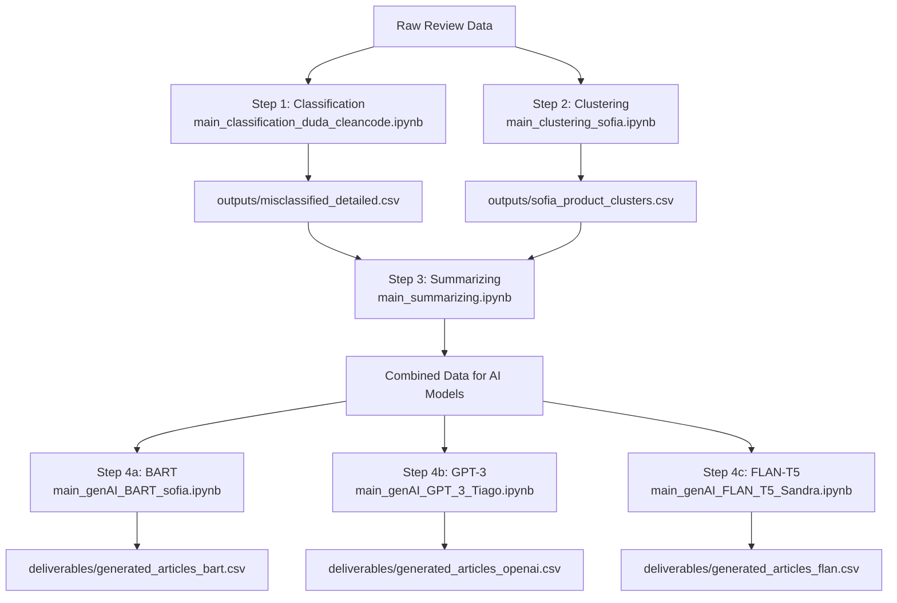

# PROJECT: Automated Customer Reviews

This project analyzes Amazon product reviews using datasets from Kaggle’s Consumer Reviews of Amazon Products: `https://www.kaggle.com/datasets/datafiniti/consumer-reviews-of-amazon-products/data` .
Because the dataset is large, it is not included in the repository — you will download it locally using the Kaggle API.

---

# Setup Guide

 ### ⚙️ 1. Clone the Repository

 ### 🧩 2. Create and Activate a Virtual Environment

 Replace the `venv_name` with the name you will give to the environment

```
python -m venv venv_name
source venv_name/bin/activate  # macOS/Linux
# OR
venv_name\Scripts\activate
```

### 📦 3. Install Requirements (packages)

```
pip install -r requirements.txt
```

### 🔐 Add Kaggle API Credentials

You’ll need a Kaggle API token to download the dataset:

1. Go to your **Kaggle account → Account Settings**.  
2. Click **Create New API Token**.  
   - This downloads a file called `kaggle.json`.  
3. Open `kaggle.json` and copy its contents into a `.env` file at the root of your project:

```
KAGGLE_USERNAME=your_kaggle_username
KAGGLE_KEY=your_kaggle_api_key
```
**Tip**: There is a `.env.example` file included. Simply remove `.example` and use it as your `.env` file.

### 5. Download the Dataset
You can download the dataset by running the respective code snippet inside the `main.ipynb` notebook.

-----
# Workflow Overview

The project follows a sequential workflow from raw review data to final AI-generated articles.


----
# How to Run:

Follow these steps to execute the project in order:

1. **Run Classification First:**  
   Open and execute:  `notebooks/main_classification_duda_cleancode.ipynb`
   
   **Output:** `outputs/data_with_sentiment_clean.csv`  
   **Purpose:** Cleans and classifies raw review data.

2. **Run Clustering Next:**  
   Open and execute:  `notebooks/main_clustering_sofia.ipynb`
   **Output:** `outputs/sofia_product_clusters.csv`  
   **Purpose:** Groups products into clusters for summarization.

3. **Run Summarizing:**  
   Open and execute:  `notebooks/main_summarizing.ipynb`
   **Inputs:**  
   - `outputs/misclassified_detailed.csv`  
   - `outputs/sofia_product_clusters.csv`  
  **Output:** Combined data ready for AI models.

4. **Generate AI Articles (choose one model)**  
   - **BART:**  
     ```
     notebooks/main_genAI_BART_sofia.ipynb
     ```  
     **Output:** `deliverables/generated_articles_bart.csv`  
   - **GPT-3:**  
     ```
     notebooks/main_genAI_GPT_3_Tiago.ipynb
     ```  
     **Output:** `deliverables/generated_articles_openai.csv`  
   - **FLAN-T5:**  
     ```
     notebooks/main_genAI_FLAN_T5_Sandra.ipynb
     ```  
     **Output:** `deliverables/generated_articles_flan.csv`  

**Notes:**  
- Run the notebooks in the order listed above.  
- Only one AI model (Step 4) needs to be executed for final article generation.  
- Ensure your virtual environment (`venv_name`) is active before running any notebook.  
- Intermediate outputs are stored in `outputs/`, final deliverables in `deliverables/`.
- Under deliverables you may find also the `RoboReviews template.pptx` which we used in our presentation.

